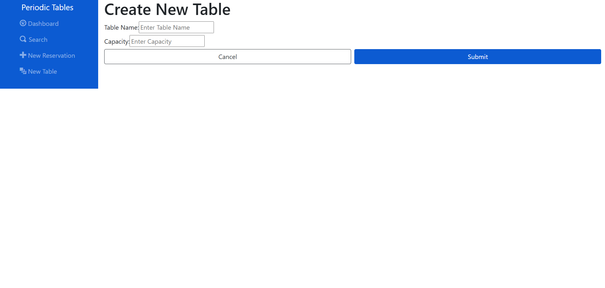

# Restaurant Reservation System

The **Restaurant Reservation System** is a full-stack application designed to manage restaurant reservations and table allocations efficiently. The system enables restaurant staff to manage reservations, monitor table statuses, and optimize seating arrangements.

This project consists of two main parts:

| Folder/File Path | Description                                                                                        |
| ---------------- | -------------------------------------------------------------------------------------------------- |
| `./back-end`     | The backend project that runs a RESTful API, using Node.js, Express, and PostgreSQL.               |
| `./front-end`    | The frontend project, built with React.js, providing a dynamic and responsive interface for users. |

The backend API manages the database of reservations and tables, while the frontend interacts with users to allow them to make and manage reservations.

## Technologies Used

### Backend

- **Node.js**: JavaScript runtime for the backend.
- **Express.js**: Web framework for building the RESTful API.
- **Knex.js**: SQL query builder for interacting with the PostgreSQL database.
- **PostgreSQL**: Relational database for storing reservations and table data.

### Frontend

- **React.js**: JavaScript library for building user interfaces.
- **React Router DOM**: Library for handling client-side routing in React.
- **Bootstrap**: Frontend framework for responsive design and styling.

### Deployment

- **Render**: Platform for deploying both frontend (as a static site) and backend (as a web service).

### Testing

- **Jest**: Testing framework for unit and integration tests.
- **Supertest**: HTTP assertions library used for testing API endpoints.

## Features

### Reservations

- **Create, Edit, Seat, and Cancel** reservations.
- **Search reservations** by mobile number.
- **Validate reservation date, time**, and **party size** to ensure they are appropriate.

### Tables

- **Add new tables** with capacity information.
- **Assign reservations** to available tables.
- **Mark tables** as either **Occupied** or **Free**.

### Dashboard

- **View reservations** for a selected date.
- Navigate between dates using **Previous**, **Today**, and **Next** buttons.
- **Monitor table status** in real-time (occupied or free).

### Validation & Error Handling

- Prevent invalid **date/time selections**.
- Ensure no table exceeds its **capacity**.
- Display clear error messages for **invalid inputs** and API responses.

## Deployment Links

- **Frontend**: [Frontend via Render](#)
- **Backend**: [Backend via Render](#)

## API Endpoints

### Reservations

- **GET /reservations**: Retrieve all reservations or filter by date.
- **POST /reservations**: Create a new reservation.
- **GET /reservations/\*\*\*\*****:reservation****\_id**: Retrieve a specific reservation by ID.
- **PUT /reservations/\*\*\*\*****:reservation****\_id**: Update an existing reservation.
- **DELETE /reservations/\*\*\*\*****:reservation****\_id**: Delete a specific reservation (if applicable).

### Tables

- **GET /tables**: Retrieve all tables.
- **POST /tables**: Create a new table.
- **PUT /tables/********:table************\_id********/seat**: Assign a reservation to a table.
- **DELETE /tables/********:table************\_id********/seat**: Remove a reservation from a table.

## Screenshots

### Dashboard

### Search

## New Reservation

## New Table
